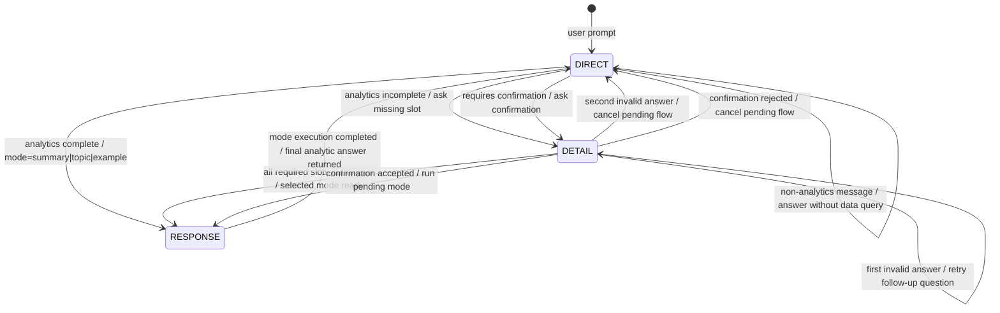

# NPS Chatbot

Banka müşteri NPS yorumlarını analiz eden Streamlit tabanlı chatbot ve dashboard projesi.
Uygulama; özet/trend soruları, kategori-segment-duygu kırılımları ve örnek müşteri yorumları için doğal dilde sorgu alır, LLM destekli intent router ile doğru analiz moduna yönlendirir.

## Özellikler

- Streamlit arayüzü: Chatbot ve dashboard sekmeleri.
- CLI arayüzü: Terminalden chatbot denemesi.
- LLM-first router: Mesajı `summary`, `topic` veya `example` moduna yönlendirir.
- Çok turlu akış: Eksik tarih, kategori veya filtre bilgisi varsa kullanıcıdan detay ister.
- Yerel veri modu: `data/raw/nps_mock_200k.parquet` üzerinden hızlı geliştirme.
- Oracle veri modu: `USE_DB=true` ile ham NPS tablosundan okuma.
- Offline hazırlık: Mock veri, özet tabloları ve hazır metin özetleri üretimi.
- Test kapsamı: Router, veri yükleyici, Oracle SQL üretimi ve analiz modları için `unittest` testleri.

## Kurulum

Python 3.9+ önerilir.

### Windows

```powershell
python -m venv .venv
.\.venv\Scripts\Activate.ps1
python -m pip install -r requirements.txt
Copy-Item .env.example .env
```

### macOS / Linux

```bash
python3 -m venv .venv
source .venv/bin/activate
python -m pip install -r requirements.txt
cp .env.example .env
```

Kurulumdan sonra `.env` dosyasındaki LLM ve gerekiyorsa Oracle ayarlarını doldurun.

## Ortam Değişkenleri

`.env.example` güncel yapı için referanstır.

| Değişken | Açıklama |
| --- | --- |
| `LITELLM_URL` | LiteLLM chat completions endpoint'i. |
| `LITELLM_API_KEY` | LLM çağrıları için API anahtarı. |
| `LLM_MODEL` | Kullanılacak model adı. Varsayılan: `openai/gpt-oss-120b`. |
| `LITELLM_VERIFY_SSL` | İç sertifika ortamları için SSL doğrulama ayarı. |
| `LITELLM_TIMEOUT` | LLM istek zaman aşımı. |
| `LLM_CONTEXT_WINDOW` | Model context penceresi bilgisi. |
| `USE_DB` | `false`: yerel Parquet, `true`: Oracle ham tablo. |
| `ORACLE_HOST`, `ORACLE_PORT`, `ORACLE_SERVICE` | Oracle bağlantı bilgileri. |
| `ORACLE_USER`, `ORACLE_PASSWORD` | Oracle kullanıcı bilgileri. |
| `ORACLE_NPS_TABLE` | Ham NPS verisinin okunacağı Oracle tablo adı. |

Not: Router doğal dili anlamak için LLM çağırır. `LITELLM_API_KEY` boşsa chatbot sınıflandırma ve genel cevaplarda hata mesajı dönebilir. Analiz modlarında LLM hatası olduğunda bazı cevaplar istatistiksel fallback ile üretilebilir.

## Çalıştırma

Streamlit uygulaması:

```bash
streamlit run ui/app.py
```

Tarayıcı otomatik açılmazsa:

```text
http://localhost:8501
```

Terminal arayüzü:

```bash
python -m chatbot.engine
```

Router kararlarını daha görünür izlemek için:

```bash
python -m chatbot.engine --router-debug
```

## Örnek Sorular

```text
Şubat 2024 NPS özeti nedir?
Mart 2024 Mobil Bankacılık şikayet analizi yap.
Ocak 2024 detractor müşterilerden 5 yorum getir.
Geçen ay kızgın müşteriler hangi konuları şikayet ediyor?
ATM için de aynı analiz.
```

## Veri Kaynakları

Varsayılan çalışma modu yerel dosyadır:

- Ham veri: `data/raw/nps_mock_200k.parquet`
- CSV karşılığı: `data/raw/nps_mock_200k.csv`
- Dashboard/özet tabloları: `data/processed/ozet_tablolari/*.parquet`
- Runtime hazır metin özetleri: `offline_hazirlik/nps_ozetler.csv`
- ETL çıktısı hazır özetler: `data/processed/hazir_ozetler/*`

`USE_DB=true` olduğunda `chatbot.data_loader.get_raw()` ham yorumları Oracle tablosundan okur. Dashboard içindeki haftalık trend tablosu ve hazır metin özetleri mevcut yapıda yerel dosyalardan okunmaya devam eder.

## ETL Komutları

Mock NPS verisini yeniden üretmek:

```bash
python etl/generate_mock_data.py
```

Üretilen çıktılar:

- `data/raw/nps_mock_200k.parquet`
- `data/raw/nps_mock_200k.csv`

Özet tablolarını ve hazır metin özetlerini üretmek:

```bash
python etl/offline_prep.py
```

Üretilen başlıca çıktılar:

- `data/processed/ozet_tablolari/gunluk_top_konular.parquet`
- `data/processed/ozet_tablolari/haftalik_trend.parquet`
- `data/processed/ozet_tablolari/aylik_trend.parquet`
- `data/processed/ozet_tablolari/segment_dagilim.parquet`
- `data/processed/ozet_tablolari/duygu_kategori_kirilim.parquet`
- `data/processed/hazir_ozetler/nps_ozetler.parquet`
- `data/processed/hazir_ozetler/nps_ozetler.csv`

## Testler

```bash
python -m unittest discover -s tests
```

Testler LLM ve Oracle bağlantısını gerçek ortamda çağırmadan mock'larla çalışır.

## Proje Yapısı

```text
nps-chatbot/
|-- .env.example                 # LLM ve Oracle ayar şablonu
|-- requirements.txt             # Python bağımlılıkları
|-- README.md
|-- chatbot/
|   |-- engine.py                # Chatbot orkestrasyonu ve CLI
|   |-- intent_router.py         # LLM-first router, state machine ve slot tamamlama
|   |-- data_loader.py           # Yerel Parquet/CSV ve Oracle veri erişimi
|   `-- modes/
|       |-- summary.py           # NPS özet modu
|       |-- topic.py             # Kategori/segment/duygu analiz modu
|       `-- example.py           # Filtreli örnek yorum modu
|-- config/
|   |-- constants.py             # Kategori, yorum tipi, duygu ve segment sabitleri
|   `-- llm_config.py            # LiteLLM bağlantı ayarları
|-- data/
|   |-- raw/                     # Mock ham veri
|   `-- processed/
|       |-- ozet_tablolari/      # Dashboard ve analiz özet tabloları
|       `-- hazir_ozetler/       # ETL ile üretilen hazır özet dosyaları
|-- etl/
|   |-- generate_mock_data.py    # 200k satırlık mock veri üretimi
|   |-- offline_prep.py          # Özet tabloları ve metin özetleri üretimi
|   `-- templates.py             # Mock yorum şablonları
|-- offline_hazirlik/
|   `-- nps_ozetler.csv          # Runtime hazır metin özetleri
|-- tests/                       # unittest testleri
`-- ui/
    `-- app.py                   # Streamlit uygulaması
```

## Veri Şeması

| Sütun | Tip | Açıklama |
| --- | --- | --- |
| `SESSION_ID` | int | Oturum ID. |
| `NPS_SCORE` | int | 0-10 arası NPS skoru. |
| `TEXT` | str | Müşteri yorumu. |
| `INPUT_AS_OF_DATE` | datetime | Yorumun girildiği tarih. |
| `RESULT_AS_OF_DATE` | datetime | Sonuçlandırma tarihi. |
| `FIRST_MAIN_CATEGORY` | str | Birinci ana kategori. |
| `FIRST_SUBCATEGORY` | str | Birinci alt kategori. |
| `SECOND_MAIN_CATEGORY` | str | İkinci ana kategori, opsiyonel. |
| `SECOND_SUBCATEGORY` | str | İkinci alt kategori, opsiyonel. |
| `COMMENT_TYPE` | str | Şikayet, Memnuniyet, Talep/Öneri veya Veri Yetersiz. |
| `EMOTION` | str | Mutsuz, Kızgın, Endişeli, Mutlu, Umutlu, Minnettar veya Veri Yetersiz. |
| `LOAD_DATE` | datetime | Tabloya yüklenme tarihi. |

## Router Yapısı

Router katmanı `chatbot/intent_router.py` içinde bulunur ve kullanıcının doğal dil mesajını analiz modlarına çeviren ana karar mekanizmasıdır. Yapı LLM-first çalışır: LLM'den JSON formatında niyet, hedef mod ve slot bilgileri alınır; tarih, kategori, duygu, yorum tipi ve NPS segmenti gibi kritik alanlar kod tarafında normalize edilip doğrulanır.

### State Machine

Router üç temel state ile çalışır:

| State | Görev |
| --- | --- |
| `DIRECT` | Yeni kullanıcı mesajını ilk kez yorumlar. Mesaj yeterince netse sorguyu çalıştırmaya hazırlar, eksik bilgi varsa `DETAIL` state'ine geçer. |
| `DETAIL` | Eksik tarih, kategori, filtre veya onay bilgisini tamamlar. Kullanıcı alakasız cevap verirse bir kez tolerans gösterir; ikinci alakasız cevapta akış sıfırlanır. |
| `RESPONSE` | Sorgu çalıştırmaya hazır hale gelmiştir. `engine.py` ilgili modu çağırdıktan sonra router tekrar `DIRECT` state'ine döner. |

Akış özeti:

```text
DIRECT
  -> analytics + complete      -> RESPONSE -> mode dispatch -> DIRECT
  -> analytics + missing slot  -> DETAIL   -> slot tamamlanırsa RESPONSE
  -> small_talk/help           -> doğrudan cevap
  -> out_of_scope/ambiguous    -> kapsam dışı veya netleştirme cevabı
```

### State Diyagramı

Aşağıdaki diyagram sadeleştirilmiş router akışını gösterir. `non-analytics message` etiketi kod tarafındaki `small_talk`, `help`, `out_of_scope` ve `ambiguous` kararlarını tek başlık altında toplar; bu mesajlarda veri sorgusu çalıştırılmaz.



### LLM Çıktısı

LLM'den beklenen karar yapısı şu alanlara ayrılır:

| Alan | Açıklama |
| --- | --- |
| `message_type` | `small_talk`, `help`, `out_of_scope`, `analytics` veya `ambiguous`. |
| `target_mode` | `summary`, `topic`, `example` veya `none`. |
| `confidence` | LLM karar güveni. Düşük güven varsa router netleştirme ister. |
| `slots` | Tarih, kategori, segment, NPS aralığı, duygu, yorum tipi, limit gibi alanlar. |
| `requires_confirmation` | Gerekirse çalıştırmadan önce kullanıcı onayı istenir. |
| `assistant_message` | Veri sorgusu gerektirmeyen cevap veya takip sorusu. |

### Mod Seçimi

Router sorguyu üç analiz modundan birine yönlendirir:

| Mod | Ne zaman kullanılır? | Çalışan dosya |
| --- | --- | --- |
| `summary` | NPS özeti, skor dağılımı, dönemsel genel görünüm. | `chatbot/modes/summary.py` |
| `topic` | Kategori, segment, duygu, yorum tipi, kök neden veya kırılım analizi. | `chatbot/modes/topic.py` |
| `example` | Belirli filtrelere uyan müşteri yorum örnekleri. | `chatbot/modes/example.py` |

`small_talk` mesajları `greeting` moduna düşer ve genel LLM cevabı üretir. Kapsam dışı mesajlarda veri sorgusu çalıştırılmaz.

### Slot Doğrulama ve Normalizasyon

LLM ham slotları çıkarır; router bunları deterministik olarak temizler:

- Tarih ifadeleri `date_range` alanına çevrilir. Örnekler: `bugün`, `dün`, `bu hafta`, `geçen hafta`, `son 1 ay`, `Şubat 2024`, `2024 Şubat`.
- Ay belirtilip yıl verilmezse router yıl tahmin etmek yerine `date_year` eksik slotu ile kullanıcıya sorar.
- Kategori alias'ları canonical kategoriye çevrilir. Örnek: `mobil`, `mobil uygulama` -> `Mobil Bankacılık`; `atm` -> `ATM`.
- Yorum tipi alias'ları normalize edilir. Örnek: `şikayetler` -> `Şikayet`, `öneri` -> `Talep/Öneri`.
- Duygu alias'ları normalize edilir. Örnek: `sinirli` -> `Kızgın`, `endişeli` -> `Endişeli`.
- NPS aralıkları segmentlere bağlanır: `0-6` -> `Detractor`, `7-8` -> `Passive`, `9-10` -> `Promoter`.

### Eksik Bilgi Kuralları

Router veri sorgusunu hemen çalıştırmadan önce minimum gereksinimleri kontrol eder:

- `summary` ve `topic` için tarih aralığı gerekir.
- `example` için tarih aralığına ek olarak en az bir filtre gerekir: kategori, segment, duygu, yorum tipi veya müşteri ID.
- Bilinmeyen kategori verilirse router kategori netleştirmesi ister.
- LLM güveni düşükse `target_mode` netleştirmesi ister.

Örnek çok turlu akış:

```text
Kullanıcı: Mobil Bankacılık şikayetlerinden 3 yorum getir
Router: Hangi dönem için bakayım?
Kullanıcı: Şubat 2024
Router: example modu için date + category + comment_type + limit parametrelerini üretir.
```

### Structured Query ve Parametre Üretimi

Router netleşen isteği önce `StructuredQuery` modeline çevirir:

```text
metric
analysis_type
date_range
filters
output
raw_slots
```

Ardından mode fonksiyonlarının beklediği düz parametrelere dönüştürür:

```text
period, date_start, date_end, date_label,
category, segment, emotion, comment_type,
nps_min, nps_max, limit
```

Bu parametreler `NPSChatbot._dispatch()` içinde `summary.respond()`, `topic.respond()` veya `example.respond()` fonksiyonlarına gönderilir.

### Konuşma Hafızası

Router `ConversationState.context` ve `last_structured_query` alanlarıyla takip sorularını destekler. Kullanıcı "aynısını Mart için", "ATM için de", "bundan 5 tane daha" gibi eksiltili mesajlar yazdığında önceki mod, kategori, yıl veya limit bilgisi korunur; sadece yeni verilen slotlar güncellenir.

### Debug

Router kararlarını terminalde izlemek için:

```bash
python -m chatbot.engine --router-debug
```

Bu modda sınıflandırma çıktısı, state geçişleri, eksik slotlar, context güncellemeleri ve üretilen parametreler loglanır.

## Mimari Akış

```text
Kullanıcı mesajı
  -> ui/app.py veya chatbot.engine CLI
  -> NPSChatbot
  -> IntentRouter
  -> summary/topic/example modu
  -> data_loader
  -> yerel Parquet veya Oracle
  -> LLM destekli cevap veya istatistiksel fallback
```
